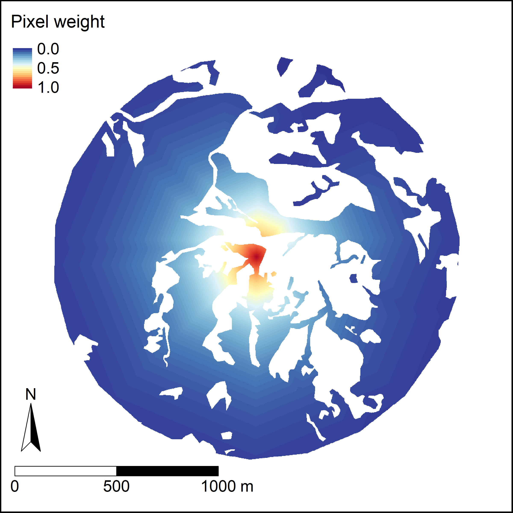

# Quantifying connectivity for wildlife

**Question**

How can we quantify the connectivity of a given study site, from the perspective of an individual species? Here, I focus on functional connectivity, or how much a given location facilitates (or impedes) wildlife movement.

**Approach**

The connectivity metric developed here essentially quantifies the amount of accessible habitat, without having to explicitly define habitat patches while digitizing.

This approach relies on two key data sources:

1.	Geospatial data layer designating habitat vs. non-habitat for the focal species. I digitized forest and regenerating forest from high-resolution Google Earth satellite imagery.

2.	Existing information about movement behavior for the focal species
    -	Gap-crossing ability. At what distance do gaps become large enough to reduce movement of that species? 
    -	Average daily movement distance, or a similar measure. Here, I used mean length of the home range.

Processing steps in Google Earth Engine

1.	Use gap-crossing ability to connect habitat within a certain distance

2.	For each habitat pixel, calculate the shortest distance (least cost distance) to the study site, staying within the boundaries of ‘habitat’.

3.	Assign weight to each habitat pixel, based on Hanski’s (1994) incidence function model, an exponential decay equation that can be arameterized with the species’ daily movement distance. While originally developed for use with discrete habitat *patches*, here I use the equation to downweights habitat *pixels* farther away from the study site.

4.	Finally, sum the weighted pixel values. This value functional connectivity, or the amount of accessible habitat for the focal species.

**Results**

I calculated functional connectivity for a tropical hummingbird species, the green hermit. Characteristics of their movement behavior – gap-crossing ability and daily movement distance – were known from previous work in the study system.

This functional connectivity measure is a strong predictor of the number of hummingbirds captured per study site.

**Code notes**

Code is written in JavaScript and meant to be run using Google Earth Engine API (code.earthengine.google.com)

- 01_Processing_digitized_layers - removes patches smaller than a certain threshold.
- 02_Calculating_connectivity - calculates functional connectivity based on hummingbird gap-crossing ability and mean home range length

**Data notes**

Imported files
- Digitized_forest_layer - hand digitization of habitat vs. non-habitat (satellite imagery from 2018, digitization completed in 2020)
- Costa_Rica_study_area - rectangle encompassing general study area
- Patch_centroids_2016-2018 - focal area centroids
- Patch_centroids_2016-2018_Buffer1000 - focal area centroids, buffered by 1000m radius

Exported files
- Digitized_forest_layer_small_removed_20200630.kml - exported from '01_Processing_digitized_layers'
- Forest_raster_with_matrix_20200630.tif - exported from '01_Processing_digitized_layers'
- Forest_raster_25m_buffer_with_matrix_20200630.tif - exported from '02_Calculating_connectivity'. Forest connected based on hummingbird gap-crossing ability (50m)
- Weighted_pixel_area_images_20200701 - exported from '02_Calculating_connectivity'. Pixel weights based on cost distance and exponential decay function.
- patchMetrics_20200701.csv - exported from '02_Calculating_connectivity'. **These are the metrics of functional connectivity for analysis.**

**References**

HANSKI, I. (1994) Patch-occupancy dynamics in fragmented landscapes. Trends in Ecology & Evolution 9, 131–135.
