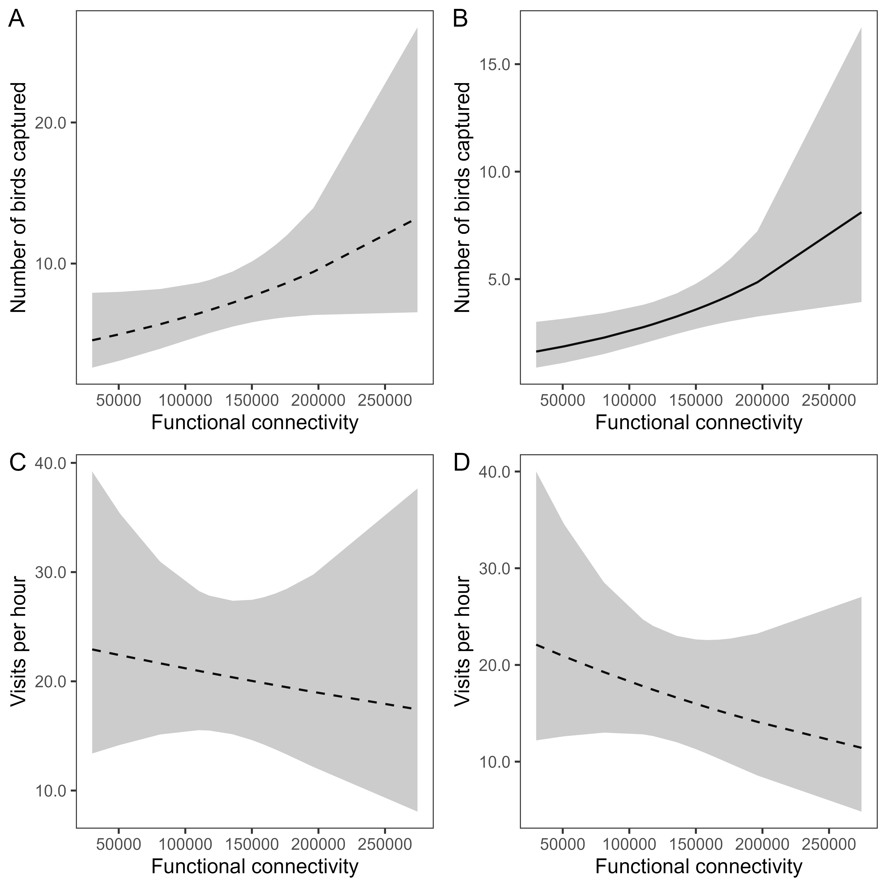
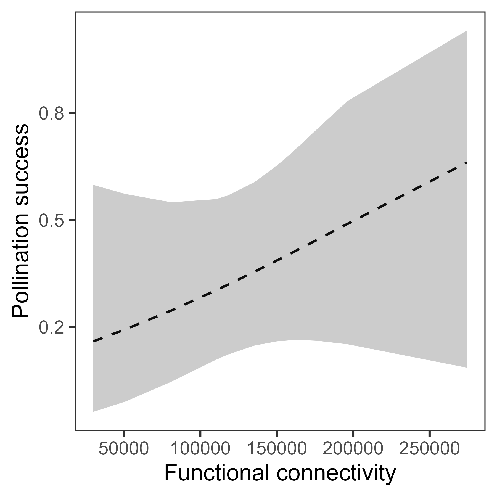
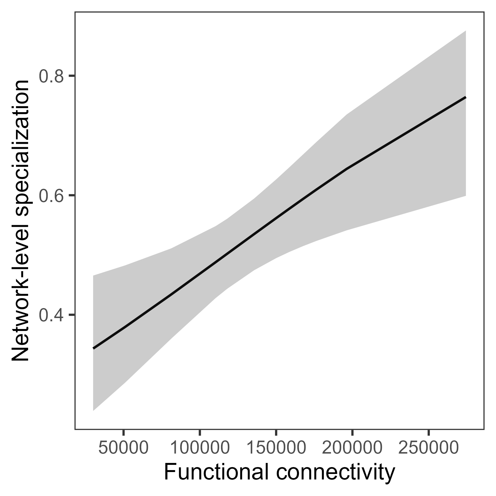

# Quantifying connectivity for wildlife

**Question**

How can we quantify the connectivity of a given study site, from the perspective of an individual species? Here, I focus on *functional connectivity*, i.e., how much a given location facilitates (or impedes) wildlife movement.

**Approach**

The connectivity metric developed here essentially quantifies the amount of accessible habitat without having to explicitly define habitat patches while digitizing.

This approach relies on two key data sources:

1.	Geospatial data layer designating habitat vs. non-habitat for the focal species. I digitized forest and regenerating forest from high-resolution Google Earth satellite imagery.

2.	Existing information about movement behavior for the focal species
    -	Gap-crossing ability. At what distance do gaps become large enough to reduce movement of that species? 
    -	Average daily movement distance, or a similar measure. Here, I used mean length of the home range.

Processing steps in Google Earth Engine

1.	Use gap-crossing ability to connect habitat within a certain distance

2.	For each habitat pixel, calculate the shortest distance (least cost distance) to the study site, staying within the boundaries of ‘habitat’.

3.	Assign weight to each habitat pixel, based on Hanski’s (1994) incidence function model, an exponential decay equation that can be parameterized with the species’ daily movement distance. While originally developed for use with discrete habitat *patches*, here I use the equation to down weights habitat *pixels* farther away from the study site.

  

4.	Finally, sum the weighted pixel values. This value represents functional connectivity - essentially, the amount of accessible habitat for the focal species.

**Results**

I calculated functional connectivity for a tropical hummingbird species, the green hermit. Characteristics of their movement behavior (i.e., gap-crossing ability and daily movement distance) were known from previous work in the study system.

I then assessed the extent to which this functional connectivity measure is associated with plant-hummingbird interactions in this study system. The most common plant species within the understory of the forest fragments is *Heliconia tortuosa* (hereafter *Heliconia*). *Heliconia* is pollinated by two hummingbird species: Green hermits and Violet sabrewings. 

Functional connectivity is strongly associated with the number of *Heliconia*-associated hummingbirds captured per study site (i.e., Green hermits and Violet sabrewings), *and* the specialization of the plant-hummingbird interaction network. We did not find evidence that connectivity influenced the visitation rates to individual *Heliconia* inflorescences or *Heliconia* pollination success.

  

  

  

**Code notes**

The following code is written in JavaScript and is meant to be run using Google Earth Engine API (code.earthengine.google.com)

- 01_processing_digitized_layers 
    * Removes patches smaller than a certain threshold. Produces these files:
      + Digitized_forest_layer_small_removed_20200630.kml 
      + Forest_raster_with_matrix_20200630.tif
    
- 02_calculating_connectivity
    * Calculates functional connectivity based on hummingbird gap-crossing ability and mean home range length. Produces these files:
      + Forest_raster_25m_buffer_with_matrix_20200630.tif
      + Weighted_pixel_area_images_20200701 **Pixel weights based on cost distance and exponential decay function**
      + patchMetrics_20200701.csv **Metrics of functional connectivity for analysis**

The following code is written in R:

- 03_visualizing_pixel_weights.Rmd
- 04_modeling_connectivity_effects.Rmd

**Data notes**

Files needed to run JavaScript code

- Digitized_forest_layer - hand digitization of habitat vs. non-habitat (satellite imagery from 2018, digitization completed in 2020)
- Costa_Rica_study_area - rectangle encompassing general study area
- Patch_centroids_2016-2018 - focal area centroids
- Patch_centroids_2016-2018_Buffer1000 - focal area centroids, buffered by 1000m radius

**References**

HANSKI, I. (1994) Patch-occupancy dynamics in fragmented landscapes. Trends in Ecology & Evolution 9, 131–135.
